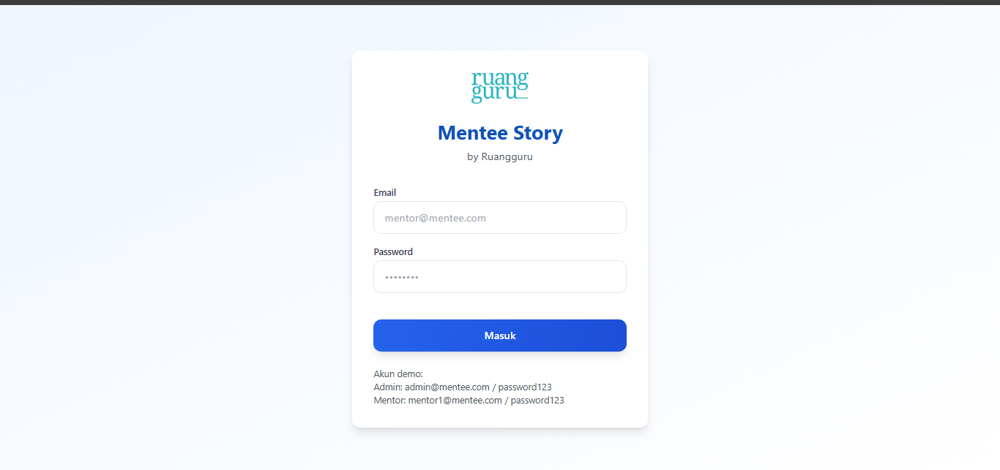
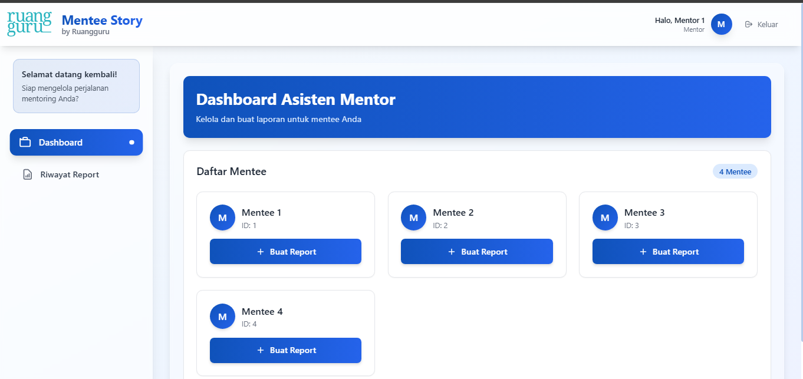
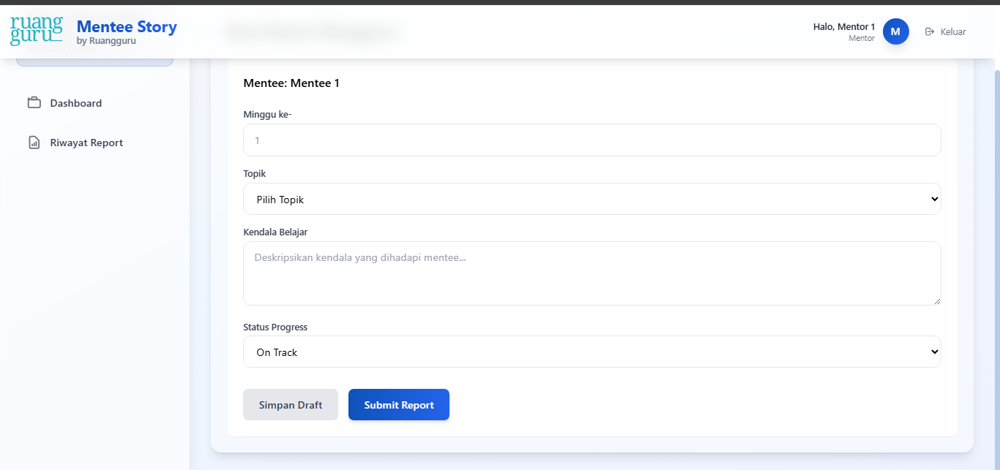

<div align="center">
  <h1>📚 Mentee Story</h1>
  <p><strong>Weekly Mentoring Report Management System</strong></p>
  <p><em>Final Project for Ruangguru Bootcamp</em></p>
  
  <p>
    
    
    
    
  </p>

</div>


## 🌟 About The Project

**Mentee Story** is a web application designed to streamline the process of creating and managing weekly reports for mentoring activities. This project was developed as the final project for the **Ruangguru Engineering Bootcamp**, demonstrating full-stack development skills using modern technologies.

### 🎓 Project Context
This application was built to solve real-world challenges faced by mentor assistants in documenting and tracking mentee progress during weekly study sessions. It showcases the implementation of:
- RESTful API design
- JWT authentication
- Role-based access control
- Responsive UI/UX design
- Database design and optimization

### 🎯 Main Objectives
- **Efficiency**: Accelerate the weekly report creation process
- **Consistency**: Standardize report formats across all mentors
- **Tracking**: Simplify monitoring of mentee progress over time
- **Collaboration**: Facilitate communication between mentors and administrators

## ✨ Features

### 👨‍🏫 Mentor Assistant Features
- ✅ **Secure Authentication**: JWT-based login system
- ✅ **Dashboard**: Overview of mentees and recent reports
- ✅ **Mentee Management**: View assigned mentees
- ✅ **Report Creation**: User-friendly weekly report editor
- ✅ **Report History**: Access previous reports
- ✅ **Topic Tracking**: Select learning topics from predefined list

### 👨‍💼 Admin Features
- ✅ **Full Access**: All mentor features plus administrative controls
- ✅ **User Management**: Complete CRUD operations for mentors and mentees
- ✅ **Topic Management**: Manage learning topic database
- ✅ **Report Overview**: View all reports across the system
- ✅ **Data Export**: Export reports for analysis (coming soon)

## 🛠 Tech Stack

### Frontend
- **Framework**: React 18.2 with Vite
- **Styling**: TailwindCSS 3.3
- **State Management**: React Hooks & Context API
- **HTTP Client**: Axios
- **Routing**: React Router v6
- **UI Components**: Custom components with TailwindCSS
- **Toast Notifications**: React Hot Toast
- **Form Validation**: Custom validation hooks

### Backend
- **Language**: Go 1.21+
- **Framework**: Gin Web Framework
- **ORM**: GORM
- **Database**: MySQL 8.0
- **Authentication**: JWT (JSON Web Tokens)
- **API**: RESTful API with JSON responses
- **Middleware**: CORS, Auth, Error handling

## 💻 System Requirements

### Prerequisites
- **Go**: Version 1.21 or higher
- **Node.js**: Version 18.0 or higher
- **MySQL**: Version 8.0
- **Git**: For version control

## 🚀 Installation

### 1. Clone Repository
```bash
git clone https://github.com/yourusername/mentee-story.git
cd mentee-story
```

### 2. Database Setup
1. Start MySQL
2. Open MySQL
3. Create a new database:
```sql
CREATE DATABASE mentee_story;
```

### 3. Backend Setup
```bash
cd backend
cp .env.example .env  # Copy environment template
# Edit .env with your database configuration
go mod download       # Install dependencies
go mod tidy          # Clean up module dependencies
```

### 4. Frontend Setup
```bash
cd ../frontend
npm install          # Install dependencies
cp .env.example .env # Copy environment template
# Edit .env if you need to change API URL
```

## 🏃‍♂️ Running the Application

### Start Backend Server
```bash
cd backend
go run main.go
```
The backend will run at `http://localhost:8080`

### Start Frontend Development Server
```bash
cd frontend
npm run dev
```
The frontend will run at `http://localhost:5173`

### Build for Production
```bash
# Frontend build
cd frontend
npm run build

# Backend build
cd backend
go build -o mentee-story
```

## 📚 API Documentation

### Authentication Endpoints
| Method | Endpoint | Description |
|--------|----------|-------------|
| POST | `/api/login` | User authentication |
| GET | `/api/me` | Get current user information |

### Public Endpoints
| Method | Endpoint | Description |
|--------|----------|-------------|
| GET | `/api/topics` | Get all available topics |

### Mentor Endpoints
| Method | Endpoint | Description |
|--------|----------|-------------|
| GET | `/api/mentor/mentees` | Get assigned mentees |
| POST | `/api/mentor/reports` | Create new report |
| GET | `/api/mentor/reports` | Get mentor's reports |

### Admin Endpoints
| Method | Endpoint | Description |
|--------|----------|-------------|
| GET | `/api/admin/mentors` | Get all mentors |
| POST | `/api/admin/mentors` | Create new mentor |
| GET | `/api/admin/mentees` | Get all mentees |
| POST | `/api/admin/mentees` | Create new mentee |
| GET | `/api/admin/topics` | Get all topics |
| POST | `/api/admin/topics` | Create new topic |
| PUT | `/api/admin/topics/:id` | Update topic |
| DELETE | `/api/admin/topics/:id` | Delete topic |
| GET | `/api/admin/reports` | Get all reports |

## 📁 Project Structure

```
mentee-story/
├── backend/
│   ├── config/         # Database and app configuration
│   ├── controllers/    # HTTP request handlers
│   ├── middleware/     # Custom middleware functions
│   ├── models/         # Database models (GORM)
│   ├── routes/         # API route definitions
│   ├── utils/          # Helper functions
│   ├── .env.example    # Environment template
│   ├── go.mod          # Go module definition
│   └── main.go         # Application entry point
│
├── frontend/
│   ├── public/         # Static assets
│   ├── src/
│   │   ├── components/ # Reusable UI components
│   │   ├── pages/      # Page components
│   │   ├── services/   # API service layer
│   │   ├── styles/     # Global styles
│   │   ├── utils/      # Utility functions
│   │   ├── App.jsx     # Root component
│   │   └── main.jsx    # React entry point
│   ├── .env.example    # Environment template
│   ├── index.html      # HTML template
│   ├── package.json    # NPM dependencies
│   ├── tailwind.config.js # Tailwind configuration
│   └── vite.config.js  # Vite configuration
│
└── README.md           # Project documentation
```

## 📸 Screenshots

<div align="center">
  <h3>Login Page</h3>
  
  
  <h3>Mentor Dashboard</h3>
  
  
  <h3>Report Creation</h3>
  
</div>

## 🔐 Default Accounts

### Admin Account
- **Email**: admin@mentee.com
- **Password**: password123

### Mentor Account
- **Email**: mentor1@mentee.com
- **Password**: password123

> ⚠️ **Security Notice**: Please change these default passwords in production!


## 🙏 Acknowledgments

- **Ruangguru Engineering Bootcamp** - For providing the learning opportunity and mentorship
- **Bootcamp Mentors** - For guidance and support throughout the project
- **Fellow Bootcamp Participants** - For collaboration and feedback
- **Open Source Community** - For the amazing tools and libraries used in this project

